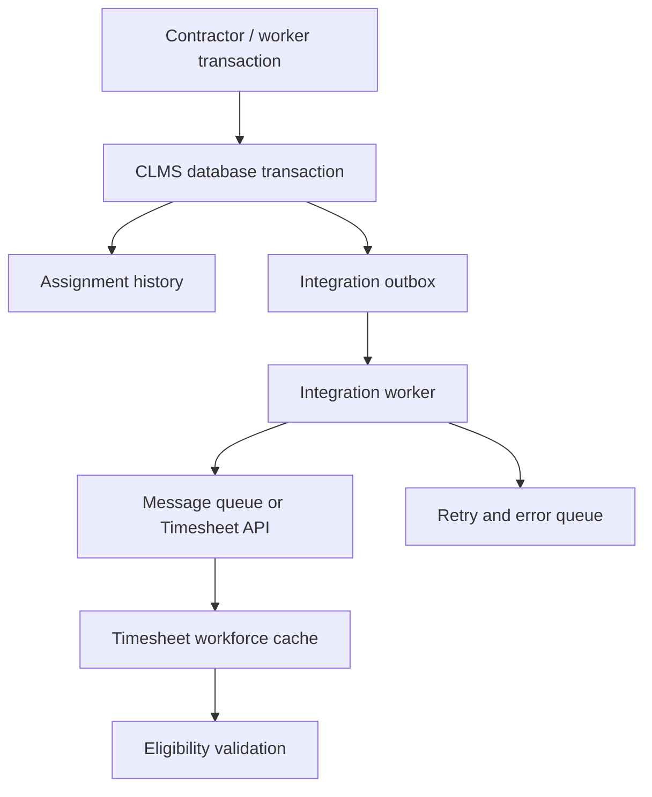

Yes, this can be integrated in near real time. However, MCP should not be the primary synchronization mechanism. The optimum approach is:

1. Contract Labour Management System remains the system of record.
2. Every contractor, work-order, worker-registration, transfer, de-registration, validity, and assignment change creates a durable integration event.
3. A small integration service sends these events to the Timesheet application through REST APIs or a message queue.
4. MCP can be added later as a controlled AI/query layer for reporting, investigation, and exception handling.

## What I found in your schema

From the supplied [db_schema.sql](sandbox:/workspace/scratch/c9a8a2e8f947/upload/db_schema.sql), the main relationships appear to be:

| Business information  | Existing table/fields                                                                        |
| --------------------- | -------------------------------------------------------------------------------------------- |
| Contractor            | `Contractor.Code`, `ContractorCode`, `VendorCode`, `Name`, `IsApproved`, `IsRestricted`      |
| Contractor validity   | `LICENSEEXPIRYDATE`, `ShopActValidity`, `ContAgreStartdate`, `ContAgreEnddate`               |
| Work/Purchase order   | `WorkOrder.Code`, `WorkOrderNo`, `ContractorCode`, `VendorCode`                              |
| Order validity        | `WorkPeriodFrom`, `WorkPeriodTo`, `ValidityFlag`                                             |
| Order approval        | `IsSecApproved`, `IsDepApproved`, `IsIRApproved`                                             |
| Worker identity       | `Name.Code`, `WorkerCode`, `IDCardNo`, `MasterCode`                                          |
| Worker status         | `Name.IsRestricted`, `IsTerminated`, `TerminateDate`, `ResignDate`                           |
| Current assignment    | `BadgeDetail.NameCode`, `Contractor`, `WorkOrderCode`, `BusinessUnit`, `Section`, `Division` |
| Registration validity | `BadgeDetail.ValidFromDate`, `ValidUptoDateTime`                                             |
| Assignment change     | `Service_ChangeContractor` stored procedure                                                  |
| Existing history      | `EmployeeHistory`, `EmpHistory`, `History`, `TransactionHistory`                             |

The important issue is that `BadgeDetail` stores only the worker’s current contractor and work order. The `Service_ChangeContractor` procedure directly overwrites those fields:

```sql
UPDATE BadgeDetail
SET Contractor = @NewContractor,
    WorkOrderCode = @NewWorkOrder
WHERE NameCode IN (...)
```

Although the schema has `EmployeeHistory`, it contains only contractor and date information. It does not adequately record the old/new work order, department, section, project, validity, transfer reason, approval status, or integration status.

Therefore, the current schema can tell the Timesheet application where a worker is assigned now, but it cannot always answer reliably:

> Which contractor/project was this worker assigned to on a particular historical date?

That is essential for timesheet and billing accuracy.

# Recommended data model

## 1. Contractor registration

Keep `Contractor` as the master, but create a separate registration table so every licence/registration renewal has its own record.

```sql
CREATE TABLE dbo.ContractorRegistration
(
    RegistrationId       bigint IDENTITY PRIMARY KEY,
    ContractorCode       int NOT NULL,
    RegistrationType     varchar(30) NOT NULL, -- WO, PO, Agreement
    OrderCode             int NULL,
    OrderNumber           varchar(200) NOT NULL,
    ValidFrom             datetime2 NOT NULL,
    ValidTo               datetime2 NOT NULL,
    Status                varchar(20) NOT NULL,
    ApprovedAt            datetime2 NULL,
    ApprovedBy            varchar(100) NULL,
    CreatedAt             datetime2 NOT NULL DEFAULT SYSUTCDATETIME(),
    ModifiedAt            datetime2 NOT NULL DEFAULT SYSUTCDATETIME(),
    RowVersion             rowversion
);
```

`RegistrationType` allows the same structure to support both work orders and purchase orders.

## 2. Effective-dated worker assignment history

This is the most important addition.

```sql
CREATE TABLE dbo.WorkerAssignment
(
    AssignmentId          bigint IDENTITY PRIMARY KEY,
    WorkerCode            int NOT NULL,
    ContractorCode        int NOT NULL,
    WorkOrderCode         int NULL,
    RegistrationId        bigint NULL,
    ProjectCode            varchar(50) NULL,
    DepartmentCode         int NULL,
    SectionCode            int NULL,
    DivisionCode           int NULL,
    EffectiveFrom          datetime2 NOT NULL,
    EffectiveTo            datetime2 NULL,
    AssignmentStatus       varchar(20) NOT NULL,
    ChangeReason           varchar(500) NULL,
    ChangedBy              varchar(100) NOT NULL,
    ChangedAt              datetime2 NOT NULL DEFAULT SYSUTCDATETIME(),
    CorrelationId          uniqueidentifier NOT NULL DEFAULT NEWID(),
    RowVersion             rowversion
);
```

Recommended statuses:

* `PENDING`
* `ACTIVE`
* `SUSPENDED`
* `DEREGISTERED`
* `TRANSFERRED`
* `EXPIRED`
* `TERMINATED`

An active assignment has `EffectiveTo = NULL`.

## 3. Worker identity

Use `Name.Code` as the internal worker key. Establish one permanent enterprise workforce ID that does not change when the contractor changes.

Recommended order of identifiers:

* Internal immutable ID: `Name.Code`
* Business workforce ID: `WorkerCode` or a new `EnterpriseWorkerId`
* Badge/token: `IDCardNo`
* Aadhaar: only for controlled duplicate verification, not as the integration key

A badge number can change. A contractor can change. The worker identity must remain constant.

## 4. Integration outbox

```sql
CREATE TABLE dbo.IntegrationOutbox
(
    EventId                uniqueidentifier PRIMARY KEY DEFAULT NEWID(),
    AggregateType          varchar(50) NOT NULL,
    AggregateId            varchar(100) NOT NULL,
    EventType              varchar(100) NOT NULL,
    EventVersion           int NOT NULL DEFAULT 1,
    Payload                nvarchar(max) NOT NULL,
    OccurredAt             datetime2 NOT NULL DEFAULT SYSUTCDATETIME(),
    PublishedAt            datetime2 NULL,
    RetryCount             int NOT NULL DEFAULT 0,
    LastError              nvarchar(2000) NULL,
    CorrelationId          uniqueidentifier NOT NULL
);
```

The application should update the business record and insert the corresponding outbox record in the same SQL transaction. This prevents a registration from being saved without being communicated to the Timesheet application.

# Recommended automated workflow



## Events that should be published

| Event                   | Trigger                                     |
| ----------------------- | ------------------------------------------- |
| `ContractorRegistered`  | Contractor registration approved            |
| `ContractorUpdated`     | Contractor master or compliance changed     |
| `ContractorSuspended`   | Contractor restricted or licence invalid    |
| `WorkOrderActivated`    | Approved WO/PO becomes valid                |
| `WorkOrderExtended`     | End date or validity changed                |
| `WorkOrderExpired`      | Validity end date reached                   |
| `WorkerRegistered`      | Worker successfully registered              |
| `WorkerAssigned`        | Worker assigned to contractor/order/project |
| `WorkerTransferred`     | Contractor or work order changes            |
| `WorkerDeregistered`    | Worker removed from a contractor            |
| `WorkerSuspended`       | Restricted/debarred                         |
| `WorkerReactivated`     | Restriction removed                         |
| `WorkerValidityChanged` | Badge or registration validity changed      |
| `WorkerTerminated`      | Worker relationship ended                   |

Example transfer event:

```json
{
  "eventId": "4958f2a7-8784-47c2-91fe-ce63cb5f06b1",
  "eventType": "WorkerTransferred",
  "eventVersion": 1,
  "occurredAt": "2026-08-25T10:35:17Z",
  "worker": {
    "workerId": 18452,
    "workerCode": "CW-0018452"
  },
  "previousAssignment": {
    "contractorCode": 123,
    "workOrderCode": 456,
    "effectiveTo": "2026-08-25T10:35:16Z"
  },
  "newAssignment": {
    "contractorCode": 178,
    "workOrderCode": 912,
    "projectCode": "PRJ-2026-041",
    "departmentCode": 22,
    "effectiveFrom": "2026-08-25T10:35:17Z",
    "validTo": "2027-03-31T23:59:59Z"
  }
}
```

# Worker transfer transaction

When transferring a worker:

1. Validate that the worker is not terminated, restricted, debarred, or expired.
2. Validate that the new contractor is approved and valid.
3. Validate that the new WO/PO belongs to that contractor.
4. Validate that the WO/PO is approved and within its validity.
5. Close the old `WorkerAssignment` by setting `EffectiveTo`.
6. Insert the new assignment.
7. Update `BadgeDetail` as the current-state record.
8. Insert `WorkerTransferred` into `IntegrationOutbox`.
9. Commit everything in one transaction.

Do not delete the old contractor relationship. Closing it with an effective end date preserves the complete audit trail.

Also modify `Service_ChangeContractor` so it calls a proper transfer procedure instead of constructing dynamic SQL strings. The current procedure’s direct update and string-based `IN` parameter make auditing, error handling, and security more difficult.

# How the Timesheet application should use the information

The Timesheet application should maintain a small local workforce/assignment cache instead of querying the CLMS production database directly.

Before accepting a timesheet, it should validate:

```text
Worker is active
AND contractor is active
AND assignment is effective on the timesheet date
AND WO/PO is valid on that date
AND project/department matches the assignment
```

For example:

```http
GET /api/v1/workers/CW-0018452/eligibility
    ?date=2026-08-25
    &projectCode=PRJ-2026-041
```

Response:

```json
{
  "eligible": true,
  "workerId": 18452,
  "contractorCode": 178,
  "workOrderNumber": "4500012478",
  "projectCode": "PRJ-2026-041",
  "departmentCode": 22,
  "validUntil": "2027-03-31T23:59:59Z",
  "assignmentVersion": 7
}
```

This API can be used as a final online validation, while event synchronization provides fast local data for normal timesheet operations.

# Best integration options

| Option                          |           Speed |    Complexity |                 Reliability | Recommendation                              |
| ------------------------------- | --------------: | ------------: | --------------------------: | ------------------------------------------- |
| Direct database sharing         |       Immediate | Low initially |                        Poor | Avoid                                       |
| Scheduled SQL export            |    5–30 minutes |           Low |                      Medium | Temporary solution                          |
| SQL Change Tracking/CDC polling | Seconds/minutes |        Medium |                        Good | Good when application changes are difficult |
| REST webhook only               |         Seconds |        Medium | Medium unless retries exist | Suitable for small volume                   |
| Transactional outbox + REST     |         Seconds |        Medium |                   Very good | Best simple option                          |
| Outbox + message broker         |  Near real time |        Higher |                   Excellent | Best enterprise option                      |

## My optimum recommendation

For your environment, I recommend:

* SQL Server transactional outbox
* A lightweight Windows background service
* REST API into the Timesheet application
* Automatic retry every 1, 5, 15 and 60 minutes
* Dead-letter/error dashboard
* Nightly reconciliation job
* Periodic full synchronization endpoint

You do not necessarily need Kafka. If transaction volumes are moderate, a background service and REST API will be simpler and fully adequate. RabbitMQ or Azure Service Bus can be introduced later if more applications consume the same workforce events.

# Fully automated versus semi-automated

## Fully automated

Use automatic flow for:

* Approved new registrations
* Validity extensions
* Normal project/department assignments
* Expiry processing
* Standard de-registration
* Successful contractor transfers

## Semi-automated

Require approval for:

* Worker already active under another contractor
* Overlapping assignments
* Invalid or expired WO/PO
* Contractor licence expired
* Worker debarred or terminated
* Duplicate identity detected
* Retroactive transfer affecting approved timesheets
* Assignment change after payroll/billing closure

The system can detect these exceptions automatically and route them to an IR/HR/Contract Cell approval screen.

# Can MCP be used?

Yes, but as a supplementary layer.

MCP is designed to expose data and tools to AI applications through a standard interface. It can expose application resources and actions such as database-backed queries or APIs. [The official MCP specification](https://modelcontextprotocol.io/specification/2026-07-28) describes it as a protocol connecting LLM applications with external data sources and tools; MCP resources can expose structured application data to clients. [MCP resources documentation](https://modelcontextprotocol.io/specification/2026-07-28/server/resources)

Useful MCP tools for your system could be:

```text
get_worker_current_assignment(worker_id)
get_worker_assignment_history(worker_id)
get_contractor_validity(contractor_code)
get_work_order_status(work_order_number)
check_timesheet_eligibility(worker_id, date, project)
list_integration_failures()
request_worker_transfer(...)
```

This would allow an authorized AI assistant to answer:

* “Which workers transferred contractors this week?”
* “Show workers whose work orders expire in 15 days.”
* “Why was this worker’s timesheet rejected?”
* “Find workers simultaneously assigned to two active contractors.”

But MCP should not replace the REST/event integration because:

* Synchronization must be deterministic and always running.
* It must not depend on an AI model deciding when to call a tool.
* Timesheet validation needs consistent transactional rules.
* MCP introduces an AI/tool-access security boundary that is unnecessary for basic system-to-system data movement.

## Final architecture recommendation

Use:

* CLMS database as system of record
* Effective-dated `WorkerAssignment` as assignment history
* Transactional outbox for reliable event capture
* REST API or message queue for near-real-time synchronization
* Timesheet-local assignment cache
* Online eligibility API for final validation
* Nightly reconciliation for missed or inconsistent records
* MCP only for AI-enabled search, explanation, monitoring, and controlled administrative actions

This gives you seamless automated flow, complete contractor-transfer history, historical timesheet accuracy, retries, auditability, and a clean path for future AI automation.
